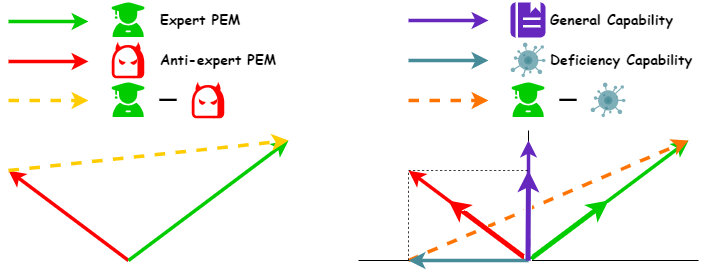

# Separate the Wheat from the Chaff: Model Deficiency Unlearning via Parameter-Efficient Module Operation

<div align="center">

 [Overview](https://github.com/JeanMaunior/Ext-Sub#sparkles-overview) | [Usage](https://github.com/JeanMaunior/Ext-Sub#rotating_light-usage) | [Citation](https://github.com/JeanMaunior/Ext-Sub#cite) | [License](https://github.com/JeanMaunior/Ext-Sub#license)

</div>

## :sparkles: Overview

<p align="center">
  
</p>

Code for the paper ["Separate the Wheat from the Chaff: Model Deficiency Unlearning via Parameter-Efficient Module Operation"](https://arxiv.org/abs/2308.08090).

## :computer: Usage

### :rainbow: Environment

```
conda create -n EXT-SUB python=3.10
conda activate EXT-SUB
pip install -r requirements.txt
```

### :fire: Train

Run the training Bash script with custom parameters: `model_name_or_path`, `data_path`, `output_dir`

```
cd training
bash train_peft.sh
```

⚠️ tips: The training code from [Alpaca](https://github.com/tatsu-lab/stanford_alpaca) was leveraged in order to resize the embedding of models, thereby incorporating a pad token. When saving the tokenizer after training, it now includes the pad token, which is not present in the original model (as only the PEMs were saved). To effectively utilize the pad token during testing, it is advisable to either resize the embedding once more or substitute the pad token with an existing token.

### :hammer: PEMs Operation

```
python ext_sub.py \
  --input_path_1  Your/Expert/PEMs/Path \
  --input_path_2  Your/Anti-Expert/PEMs/Path \
  --alpha 1.0 \
  --method ext-sub \
  --output_path  Your/Output/PEMs/Path
```

### :rocket: Load Model

```
model_name_or_path = ""

config = PeftConfig.from_pretrained(model_name_or_path)
model = AutoModelForCausalLM.from_pretrained(config.base_model_name_or_path, torch_dtype=torch.float16, device_map="auto")
model = PeftModel.from_pretrained(model, model_name_or_path)
model = model.cuda()

tokenizer = AutoTokenizer.from_pretrained(config.base_model_name_or_path, use_fast=False)
```

### :bar_chart: Evaluation

Coming soon

### :file_folder: Download

We have made our trained LoRA checkpoints available through [Google Drive](https://drive.google.com/drive/folders/13XhqHvLiTfwnrUZdSrQyGPZPh4iYXd-3?usp=sharing).

The base model can be obtained from the HuggingFace model hub: [huggyllama/llama-7b](https://huggingface.co/huggyllama/llama-7b) and [huggyllama/llama-13b](https://huggingface.co/huggyllama/llama-13b).
Please remember to modify the `base_model_name_or_path` in the `adapter_config.json` file to the local path on your system.

## :link: Cite

```
@article{hu2023separate,
  title={Separate the Wheat from the Chaff: Model Deficiency Unlearning via Parameter-Efficient Module Operation},
  author={Hu, Xinshuo and Li, Dongfang and Zheng, Zihao and Liu, Zhenyu and Hu, Baotian and Zhang, Min},
  journal={arXiv preprint arXiv:2308.08090},
  year={2023}
}
```

## :scroll: License

This repository respects to MIT license.